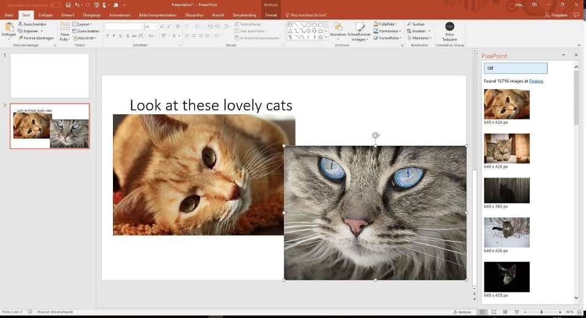

# PixaPoint

PixaPoint is an AddIn for Microsoft Powerpoint to add copyright free images from [PixaBay](https://pixabay.com/). It will add a side bar to seach and insert images:


This project was generated with [Angular CLI](https://github.com/angular/angular-cli) version 1.0.3.

# Development

[](https://travis-ci.org/BitSchupser/pixapoint)

## Development environment

1. Create a file src/app/private.config.ts with following content:

```
export class PrivateConfig
{
    // get your api key from https://pixabay.com/api/docs/
    static readonly pixabayApiKey = 'your-api-key';
}
```

2. Set up the standard office development environment as shown at https://dev.office.com/docs/add-ins/testing/create-a-network-shared-folder-catalog-for-task-pane-and-content-add-ins

3. Start server with ng serve --watch --ssl

4. Use F12Chooser (located in Windows 10 at C:\Windows\SysWOW64\F12\F12Chooser.exe) for debugging.

## Development server

Run `ng serve --watch --ssl` for a dev server. Navigate to `http://localhost:4200/`. The app will automatically reload if you change any of the source files.

## Code scaffolding

Run `ng generate component component-name` to generate a new component. You can also use `ng generate directive|pipe|service|class|module`.

## Build

Run `ng build` to build the project. The build artifacts will be stored in the `dist/` directory. Use the `-prod` flag for a production build.

## Running unit tests

Run `npm test` to execute the unit tests via [Karma](https://karma-runner.github.io).

## Further help

To get more help on the Angular CLI use `ng help` or go check out the [Angular CLI README](https://github.com/angular/angular-cli/blob/master/README.md).
